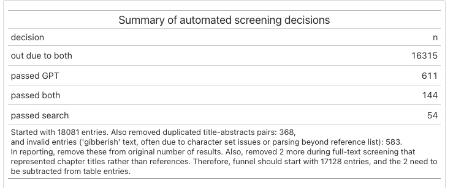

```{r setup, message=FALSE}
if (!require(groundhog)) install.packages('groundhog')
groundhog::groundhog.library(c("readxl", "googlesheets4", "tidyverse", "gt"), date = "2023-07-09")

groundhog::groundhog.library(c("lukaswallrich/timesaveR"), date = "2023-07-09")

source("helpers/helpers.R")
```

# Original results and deduplication


```{r}
deduplicated_hits <- qs::qread("../Code 1 - Search and screening/results_final/final_deduplicated_results.qs")

sources <- deduplicated_hits %>% select(duplicate_id, source) %>% separate(source, into = paste0("source", 1:10), sep = ";", fill = "right") %>% 
  pivot_longer(cols = starts_with("source"), names_to = "source_id", values_to = "source") %>% 
  mutate(source = str_squish(source)) %>% 
  filter(!is.na(source)) 

source_counts <- sources %>% 
  count(source) %>% 
    filter(!str_detect(source, "_previous")) %>% 
  bind_rows(
    sources %>% 
  filter(str_detect(source, "_previous")) %>% 
  summarise(source = "previous_reviews_citations", n = n_distinct(duplicate_id))
  ) 


source_counts %>% 
  gt::gt() %>% 
  grand_summary_rows(columns = n, fns = list(Total = ~sum(., na.rm = TRUE)), decimals = 0) %>% 
  tab_source_note(glue::glue("Prior to screening, {sum(source_counts$n) - nrow(deduplicated_hits)} duplicates were removed, so that {nrow(deduplicated_hits)} were screened."))


```

# Screening


```{r message=FALSE, warning=FALSE}
s <- read_csv("../Code 1 - Search and screening/results_screened/asreview_main.csv") %>% 
  mutate(included = ifelse(included == 3, 1, included)) %>% 
  count(included) %>% mutate(included = as.character(included))

s <- s %>% bind_rows(
  tibble(included = "further duplicates", n = nrow(deduplicated_hits) - sum(s$n))
)

s %>% mutate(share = n/sum(n)) %>% 
  gt::gt() %>% 
  grand_summary_rows(columns = n, fns = list(Total = ~sum(., na.rm = TRUE)), decimals = 0) %>% 
  fmt_percent(columns = share, decimals = 1)
```

# For non-English

```{r}
n_e_screened <- map_dfr(list.files(file.path("../Code 1 - Search and screening/results_screened/non-English"), full.names = TRUE) %>% set_names(str_extract(.,  "/[^/]*$") %>% str_remove("/")), \(f) {
  read_csv(f, show_col_types = FALSE) %>% count(included)
}, .id = "language")

ne_summary <- n_e_screened %>% mutate(
  language = str_remove(language, "\\.csv") %>% str_remove("asreview_"),
  included = case_when(
    is.na(included) ~ "excluded-auto",
    included == 0 ~ "excluded",
    included == 1 ~ "included"
  )) %>% 
  pivot_wider(names_from = included, values_from = n) %>% 
  mutate(included = coalesce(included, 0), # Account for languages with no included articles
   share_screened = (excluded+included)/(excluded+included+`excluded-auto`)) %>% 
  rowwise() %>% 
  mutate(total = sum(excluded, included, `excluded-auto`, na.rm = TRUE)) 

ne_summary %>%  
           gt::gt() %>% grand_summary_rows(columns = c(-language, -share_screened), fns = list(Total = ~sum(., na.rm = TRUE)), decimals = 0) %>%
  fmt_percent(columns = share_screened, decimals = 1) %>%
  tab_header(title = "Screening of non-English results")

rm("n_e_screened")
```

# Backwards chasing

See Code 1 - file 4 for retrieval:

*Report in there is*

- Retrieved from Scopus (358 sources): 2,8754
- Retrieved from PDFs (93 sources): 8,319

And SM1 - code 4a for automated screening report:


# Final sample and FT screening results

```{r message=FALSE}
googlesheets4::gs4_deauth()
ft_screening_en <- googlesheets4::read_sheet("https://docs.google.com/spreadsheets/d/1pEYZUZvFr8qmULT077y932BUShpJvhs-asRuyyiBKlQ/edit#gid=1628922200", 
                                             sheet = "Full-text screening",
                                             skip = 0,
                                             col_types = "c",
                                              na = c("#N/A", "NA", "")) %>% 
  mutate(ID = str_remove(ID, "\\.0$"))

ft_screening_n_en <- googlesheets4::read_sheet("https://docs.google.com/spreadsheets/d/1XCjlC3u7Ws2KCjaRQ1R0VuU0mLQ5mHVipmzuGtivLCs/edit#gid=1553069535", 
                                             sheet = "Full-text screening",
                                             skip = 1,
                                             col_types = "c",
                                              na = c("#N/A", "NA", "")) %>% 
  mutate(ID = str_remove(ID, "\\.0$"))

cn_meta_count <- {ft_screening_en %>% filter(str_detect(Notes, "cn_meta")) %>%
    nrow()} + {ft_screening_n_en %>% filter(str_detect(ID, "^cn_meta")) %>% nrow()}

ft_source_counts <- ft_screening_en %>% select(Source) %>% bind_rows(
  ft_screening_n_en %>% select(Source)) %>% 
  mutate(Source = case_when(
    tolower(Source) == "aa" ~ "Author submissions",
    tolower(Source) == "bw" ~ "backwards chasing",
    tolower(Source) == "search" ~ "database search",
   )) %>% 
  count(Source) 

ft_source_counts %>% 
  gt::gt(rowname_col = "Source")  %>% 
  grand_summary_rows(columns = n, fns = list(Total = ~sum(., na.rm = TRUE)), decimals = 0) %>% 
    tab_footnote(glue::glue("AA includes {cn_meta_count} sources extracted from the Chinese-language meta-analysis by Ma et al. (2022) shared by the author."), locations = cells_stub(rows = "Author submissions")) %>% 
  tab_footnote(glue::glue("During FT retrieval, {s$n[na.omit(s$included == '1')] + sum(ne_summary$included, na.rm = TRUE) - ft_source_counts$n[ft_source_counts$Source == 'search']} duplicates were identified and removed"), locations = cells_stub(rows = "database search"))

```

```{r}
exlusion_reasons <- ft_screening_en %>% filter(`Decision (in/out)` == "Excluded") %>% 
  mutate(Duplicate = null_to_NA(Duplicate)) %>% 
  mutate(first_exclusion_reason = pmap_chr(select(., 17:30), ~names(ft_screening_en[17:30])[which(!is.na(c(...)))[1]])) %>% 
  select(ID, Source, first_exclusion_reason)

exlusion_reasons_nen <- ft_screening_n_en %>% filter(`Decision (in/out)` == "Excluded") %>% 
  mutate(Duplicate = null_to_NA(Duplicate)) %>% 
  mutate(first_exclusion_reason = pmap_chr(select(., 19:31), ~names(ft_screening_n_en[19:31])[which(!is.na(c(...)))[1]])) %>% 
  select(ID, Source, first_exclusion_reason)

exlusion_reasons %>% bind_rows(exlusion_reasons_nen) %>% 
  mutate(exclusion_reason = fct_recode(first_exclusion_reason,
    "Duplicate" = "Duplicate",
    "Diversity Measure" = "Team Diversity measure \n(cog, job-rel OR dem)",
    "Diversity Measure" = "Diversity measure \n(cog, job-rel, dem)",
    "Diversity Measure" = "not just perceived",
    "Diversity Measure" = "… NOT disparity",
    "Performance Measure" = "Performance measure",
    "Performance Measure" = "… at team-level or TT",
    "ES Data Missing" = "ES missing (and cannot be obtained)",
    "ES Data Missing" = "ES missing",
    "FT Missing" = "FT not found/ available",
    "FT Missing" = "No FT access",
    "Team Size Issue" = "median team <= 2",
    "Team Size Issue" = "or > 25",
    "Students" = "Student sample (unless work-related performance)",
    "Not Empirical" = "Empirical \nquantitative w/ humans (not ABMs)",
    "Not Empirical" =  "Empirical \nquantitative",
    "Major bias risks" = "Major risk of bias"
  )) %>% count(Source = c("Other", "Search")[as.numeric(tolower(Source) == "search")+1], exclusion_reason) %>%
  pivot_wider(names_from = "Source", values_from = n) %>%
  gt::gt()

```

# Final dataset 

```{r}
dataset <- read_rds("data/full_dataset.rds")
```

The final dataset contained `r nrow(dataset)` effects from `r n_distinct(dataset$id)` sources.
